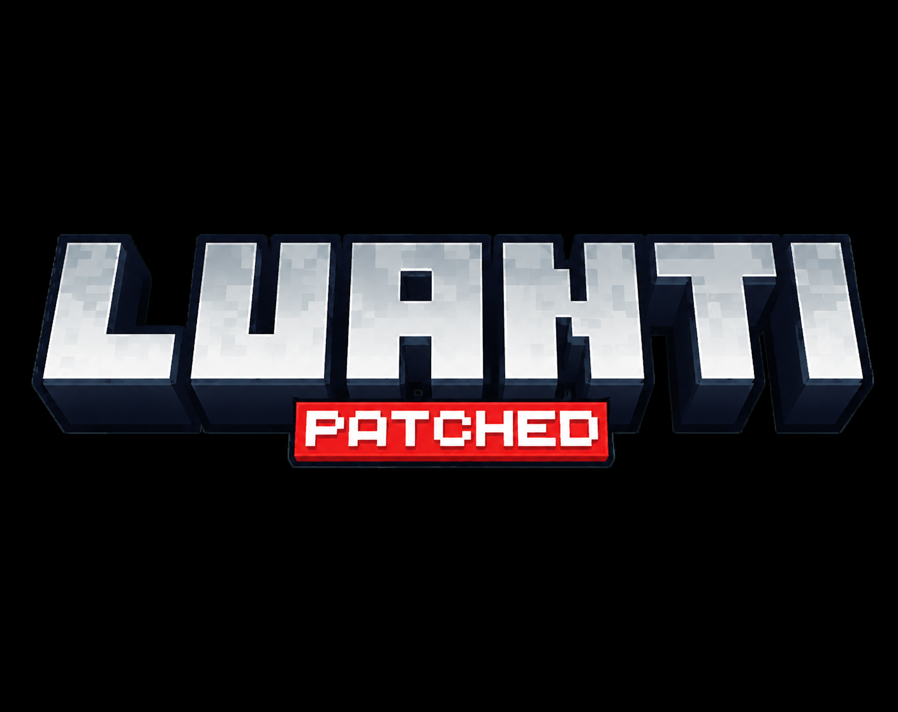

# 🚀 Luanti Fork API Documentation

<div align="center">



# **Fork APIs Guide**
*A comprehensive reference for the extended Luanti API*

[](LICENSE.txt)
[](#1-player-synchronisation-improvements)

---

> 📖 **This document covers all custom APIs and extensions added by this fork**
> 
> For core Luanti documentation, visit [docs.luanti.org](https://docs.luanti.org/)

</div>

---

## 📋 Table of Contents

1. [Player Synchronisation Improvements](#1-player-synchronisation-improvements)
2. [Camera API](#2-camera-api)
3. [FOV (Field of View) API](#3-fov-field-of-view-api)
4. [Android: htmlview API](#4-android-htmlview-api)
5. [glTF Multi-Clip Animation](#5-gltf-multi-clip-animation)
6. [Improved Animation & Scaling API](#6-improved-animation--scaling-api)
7. [glTF Inspection Helpers](#7-gltf-inspection-helpers)
8. [Independent Bone Transform API](#8-independent-bone-transform-api)
9. [Bone Override API](#9-bone-override-api-undocumented)
10. [Physics & Movement API](#10-physics--movement-api)
11. [Accessibility Features](#11-accessibility-features)
12. [Fog API](#12-fog-api)
13. [World Switching API](#13-world-switching-api)
14. [Player Callbacks](#14-player-callbacks)
15. [Undocumented Extensions](#15-undocumented-extensions)

---

## 1. Player Synchronisation Improvements

### Overview

This fork introduces a dedicated network packet for updating look direction independently of position. Previously, calling `set_look_vertical` or `set_look_horizontal` triggered a full "teleport" packet that reset the player's position, effectively "freezing" the player if called frequently for smooth camera animations.

### Improved Methods

```lua
ObjectRef:set_look_vertical(radians)
ObjectRef:set_look_horizontal(radians)
```

| Feature | Description |
|---------|-------------|
| **New Behavior** | On supported clients (protocol version ≥ 52), these methods only sync look direction |
| **Free Movement** | Player can continue moving freely while camera orientation is controlled by server |
| **Backward Compatible** | Automatically falls back to teleport behavior for older clients |

### Example

```lua
-- Smooth camera animation (doesn't freeze player anymore!)
minetest.register_globalstep(function(dtime)
    local time = minetest.get_gametime()
    local pitch = math.sin(time * 2) * 0.3  -- Gentle bobbing
    local player = minetest.local_player
    if player then
        player:set_look_vertical(pitch)
    end
end)
```

---

## 2. Camera API

### Overview

Server-side `ObjectRef` methods for controlling the player's camera, including mode, tilt, and orientation smoothing.

### Setting Camera State

```lua
ObjectRef:set_camera(table)
```

**Parameters:**

| Parameter | Type | Default | Description |
|-----------|------|---------|-------------|
| `mode` | string | - | Camera mode: `"firstperson"`, `"thirdpersonback"`, `"thirdpersonfront"` |
| `free_look` | boolean | `false` | If `true`, server-forced orientation updates are applied additively to player's current orientation |
| `smooth` | boolean | `false` | If `true`, orientation changes are smoothed (0.05s default window) even without cinematic mode |
| `tilt` | number | `0` | Camera roll in degrees |
| `anti_tilt_controller` | boolean | `false` | If `true`, controls stay fixed to screen even when camera is tilted. If `false`, controls rotate with camera |
| `fov` | number | - | Field of View. Set to `0` to reset to client default |
| `fov_is_multiplier` | boolean | `false` | If `true`, `fov` is treated as a multiplier for player's base FOV |
| `fov_transition` | number | `0.0` | Smooth FOV transition duration in seconds |

### Getting Camera State

```lua
ObjectRef:get_camera() -> table
```

**Returns:**
```lua
{
    mode = "firstperson",
    free_look = false,
    smooth = false,
    tilt = 0,
    anti_tilt_controller = false,
    fov = 0,
    fov_is_multiplier = false,
    fov_transition = 0
}
```

### Examples

```lua
-- Cinematic camera with tilt
player:set_camera({
    mode = "thirdpersonback",
    tilt = 15,  -- 15 degrees roll
    smooth = true
})

-- First person with wide FOV
player:set_camera({
    mode = "firstperson",
    fov = 100,
    fov_transition = 1.5  -- Smooth 1.5s transition
})
```

---

## 3. FOV (Field of View) API

### Overview

Explicit FOV control methods, both as standalone functions and part of the camera API.

### Methods

```lua
-- Set FOV
ObjectRef:set_fov(degrees, is_multiplier?, transition_time?)

-- Get FOV
ObjectRef:get_fov() -> table
```

### Parameters

| Parameter | Type | Default | Description |
|-----------|------|---------|-------------|
| `degrees` | number | required | FOV in degrees. `0` resets to client default |
| `is_multiplier` | boolean | `false` | Treat value as a multiplier for base FOV |
| `transition_time` | number | `0` | Smooth transition duration in seconds |

### Return Value

```lua
{
    fov = 75.0,
    is_multiplier = false,
    transition_time = 0.5
}
```

---

## 4. Android: htmlview API

### Overview

Android-only HTML view system for creating rich UI elements using HTML/CSS/JavaScript. Includes support for headless workers, shared memory IPC, and capture functionality.

> ⚠️ **Platform Restriction**: On non-Android platforms, calling these functions throws an error.

> 💡 **Lifecycle**: HTMLViews are owned by the Android activity layout and are destroyed when leaving a world or stopping the server.

---

### 4.1 Creating Instances

```lua
-- Create from inline HTML
htmlview.run(id, html_string)

-- Create from external HTML files
htmlview.run_external(id, root_dir, entry?)
```

**Parameters:**
- `id`: Unique string identifier for the view
- `html_string`: Inline HTML content
- `root_dir`: Directory containing HTML files (sandbox-checked)
- `entry`: Entry file name (default: `"index.html"`)

### 4.2 Headless Workers

Workers run without a visible view but still support messaging and JavaScript injection.

```lua
htmlview.run_worker(id, html_string)
htmlview.run_external_worker(id, root_dir, entry?)
```

**Supported Operations:**
- ✅ `send`, `inject`, `navigate`, `on_message`, `on_message_json`
- ❌ `display`, `focus` (ignored for workers)

### 4.3 Display & Positioning

```lua
htmlview.display(id, opts)
```

**Options:**

| Option | Type | Default | Description |
|--------|------|---------|-------------|
| `visible` | boolean | `true` | Show or hide the view |
| `safe_area` | boolean | `true` | Respect Android safe areas |
| `fullscreen` | boolean | `false` | Fill entire screen |
| `drag_embed` / `draggable` | boolean | `false` | Make view draggable |
| `border_radius` | number | `0` | Corner radius in pixels (negative values clamped to 0) |
| `x`, `y` | number/string | `0` | Position in pixels or `"center"` for centering |
| `width`, `height` | number/string | `1` | Size in pixels or `"fullscreen"` (setting either to `"fullscreen"` is equivalent to `fullscreen = true`) |

### 4.4 Focus Management

```lua
htmlview.focus(id)
```
Brings the specified HTMLView to the front when multiple are open.

### 4.5 Stopping Views

```lua
htmlview.stop(id)
```
Destroys the HTMLView instance and releases resources.

### 4.6 Messaging

```lua
-- Send raw string message
htmlview.send(id, message)

-- Send JSON-encoded Lua value
htmlview.send_json(id, value)

-- Register plain string message callback
htmlview.on_message(id, function(message) end)

-- Register JSON message callback
htmlview.on_message_json(id, function(decoded_table, raw_string) end)
-- On success: callback(decoded_table, raw_string)
-- On parse error: callback(nil, raw_string, error_string)

-- Register ready callback (fired after onPageFinished)
htmlview.on_ready(id, function() end)

-- Forward messages between views
htmlview.pipe(from_id, to_id)
```

### 4.7 Navigation & JavaScript

```lua
htmlview.navigate(id, url)    -- Navigate to URL
htmlview.inject(id, js)       -- Execute arbitrary JavaScript
htmlview.reload(id)           -- Reload without destroying instance
```

**Reload Behavior:**
- `run_external*`: Reloads the current entry file
- `run*`: Reloads the last provided HTML

### 4.8 Shared Memory IPC

Zero-overhead data exchange between HTMLView workers and Lua. Useful for high-frequency data sharing without message serialization overhead.

**Lua Side:**
```lua
htmlview.shared_set(key, val)  -- Set value (must be string or nil)
htmlview.shared_get(key)       -- Get value, returns nil if not found or empty string
```

**JavaScript Side:**
```javascript
luanti.shared_set(key, val);
luanti.shared_get(key);  // Returns string or null
```

> ⚠️ Note: `val` must be a string or `nil`. Non-string values must be serialized before calling.

### 4.9 Capture

```lua
htmlview.capture(id, opts?)
```

**Options:**
- `width`: Capture width (default: 0 = view's natural size)
- `height`: Capture height (default: 0 = view's natural size)
- Negative values are clamped to 0

```lua
htmlview.on_capture(id, function(png_bytes) end)
-- png_bytes is a Lua string containing PNG file data
```

### 4.10 Input Control

```lua
htmlview.input(id, {
    block_game_input = boolean  -- Default: false
})
```

When enabled and the view is visible, touches outside the HTMLView are swallowed, preventing interaction with the world behind it.

### 4.11 State Query

```lua
htmlview.state(id) -> table | nil
```

Returns `nil` on error, on non-Android platforms, or if JSON parsing fails. Otherwise:
```lua
{
    exists = true,
    worker = false,
    visible = true,
    ready = true  -- true after onPageFinished
}
```

---

## 5. glTF Multi-Clip Animation

### Overview

glTF/GLB meshes can contain multiple named animations. This fork loads each glTF `animations[i]` as a selectable clip, enabling complex animation state machines.

### Setting Animation

```lua
-- Legacy positional form (clears any selected clip)
ObjectRef:set_animation(frame_range, frame_speed, frame_blend, frame_loop)

-- New table form (recommended)
ObjectRef:set_animation(opts)
```

**Options Table:**

| Option | Type | Default | Description |
|--------|------|---------|-------------|
| `clip` | number/string | - | Clip index (0-based) or clip name from glTF file |
| `range` / `frame_range` | `{x, y}` | - | Animation frame range |
| `frame` | number | - | Set `{frame, frame}` for single frame pose |
| `speed` / `frame_speed` | number | - | Animation speed |
| `speed_scale` | number | `1.0` | Speed multiplier applied after `speed` |
| `blend` / `frame_blend` | number | `0.1` | Crossfade blend duration in seconds |
| `loop` / `frame_loop` | boolean | - | Loop the animation |
| `pause` / `paused` | boolean | - | Pause the animation (sets speed to 0) |
| `time_mode` | string | `"auto"` | Time unit handling (see Enhanced Animation API) |

### Explicit Clip Selection

```lua
ObjectRef:set_animation_clip(clip, frame_range, frame_speed, frame_blend, frame_loop)
```
- `clip` can be a number (0-based index) or string (clip name)

### Getting Animation Info

```lua
ObjectRef:get_animation() -> frame_range, frame_speed, frame_blend, frame_loop, clip
```
Returns five values. `clip` is a number (index), string (name), or `nil` if no clip selected.

```lua
ObjectRef:get_animation_info() -> table
```

**Returns:**
```lua
{
    range = {x = 0, y = 100},
    speed = 30.0,
    blend = 0.1,
    loop = true,
    clip = "Walk",           -- number, string, or nil
    duration = 3.33,         -- seconds (0 if speed is zero or range is degenerate)
    progress = nil,          -- placeholder (not currently available)
    bones = nil,             -- placeholder (not currently available)
    is_gltf = true,
    unit = "seconds"         -- "seconds" or "frames"
}
```

### Crossfade Blending

For skinned meshes (including glTF), `frame_blend` controls crossfade duration when switching animations, enabling smooth transitions between animation states.

### Examples

```lua
-- Play a named clip
entity.object:set_animation({
    clip = "Run",
    speed = 1.0,
    loop = true
})

-- Play frame range from a specific clip
entity.object:set_animation({
    clip = 2,  -- Third clip by index
    range = {x = 10, y = 50},
    speed = 24.0,
    blend = 0.2
})

-- Pause animation
entity.object:set_animation({pause = true})
```

---

## 6. Improved Animation & Scaling API

### Overview

Automatic model scaling and unified time handling between different model formats (glTF vs B3D/X).

### Scaling Properties

Set via `ObjectRef:set_properties()`:

| Property | Type | Description |
|----------|------|-------------|
| `auto_normalize` | boolean | If `true`, engine measures model's actual size and scales it so 1 unit in file = 1 node in game |
| `target_height` | number | Forces the model to a specific height in nodes regardless of original export size |
| `model_unit_scale` | vector | Additional multiplier applied after normalization. Useful for making model wider/thinner without changing height |

**Example:**
```lua
entity.object:set_properties({
    visual = "mesh",
    mesh = "character.gltf",
    auto_normalize = true,     -- 1 unit in file = 1 node in game
    target_height = 1.7,       -- Force character to be exactly 1.7 nodes tall
    model_unit_scale = {x = 1, y = 1, z = 1}  -- No extra scaling
})
```

### Enhanced Animation Time Mode

glTF animations use seconds for their range, while older formats use frames. The `set_animation` API now handles this automatically:

```lua
ObjectRef:set_animation({
    range = {x = 0, y = 2.0},  -- 2 seconds regardless of format
    speed = 1.0,
    time_mode = "auto"  -- or "seconds" or "frames"
})
```

| Mode | glTF Behavior | B3D/X Behavior |
|------|---------------|----------------|
| `"auto"` (default) | Uses seconds | Uses frames (default speed 15.0). Prints warning if speed > 5.0 |
| `"seconds"` | Uses seconds | Auto-converts to frames using 24 FPS |
| `"frames"` | Auto-converts to seconds using 24 FPS | Uses frames |

### Model Introspection

```lua
ObjectRef:get_model_info() -> table
```

**Returns:**
```lua
{
    mesh = "character.gltf",
    format = "gltf",    -- "gltf" or "b3d"
    uses_time = true,   -- true if model uses seconds natively (glTF)
    default_speed = 1.0 -- glTF: 1.0, others: 15.0
}
```

### Engine Fixes

- ✅ Fixed "Tiny Model" bug with degenerate frame ranges (where x ≈ y)
- ✅ Cleaner glTF clip transitions (disabled interpolation across different clips)
- ✅ Safety warnings for high speed values with glTF in "auto" mode

---

## 7. glTF Inspection Helpers

### Overview

Server-side glTF file parsing without loading the model into the game. Useful for building animation selection UIs or validating model contents.

### Getting Animation Clips

```lua
core.gltf_get_animation_clips(path) -> list | nil, error_string
```

**On success, returns:**
```lua
{
    {index = 0, name = "Walk", start = 0.0, end = 2.5, duration = 2.5},
    {index = 1, name = "Run", start = 0.0, end = 1.8, duration = 1.8},
    ...
}
```

- `start` is always `0.0`
- `end` and `duration` are equal and reflect measured clip length

### Inspecting Full Structure

```lua
core.gltf_inspect(path) -> table | nil, error_string
```

**On success, returns:**
```lua
{
    meshes = {
        {index = 0, name = "Body", primitives = 1},
        {index = 1, name = "Head", primitives = 2}
    },
    bones = {
        {node = 12, name = "Bone"},
        {node = 15, name = "Bone.001"}
        -- Note: Order is non-deterministic (built from hash set)
    },
    animations = {
        {index = 0, name = "Walk", start = 0.0, end = 2.5, duration = 2.5},
        ...
    }
}
```

> ⚠️ Both functions are subject to the engine's secure path check.

---

## 8. Independent Bone Transform API

### Overview

Per-bone transform control with independent position, rotation, and scale. Each transform type is stored and synced separately—calling `set_bone_rotation` only updates rotation without affecting position or scale overrides.

### Setting Bone Transforms

```lua
ObjectRef:set_bone_position(bone, position, opts?)
ObjectRef:set_bone_rotation(bone, rotation, opts?)
ObjectRef:set_bone_scale(bone, scale, opts?)
```

**Arguments:**
- `bone`: String name of the bone
- `position/rotation/scale`: Table `{x, y, z}` or three separate numbers. `set_bone_scale` also supports a single number for uniform scaling.
- `opts`: Optional table with:
  - `absolute`: boolean (default `false`). If `true`, replaces animation transform entirely. If `false`, adds on top (ideal for head look and additive overrides).
  - `interpolation`: float (default `0.0`, or bone's persistent smooth value if set). Smooth transition duration in seconds.

**Rotation Units:** Degrees (converted internally to/from radians)

### Getting Bone Transforms

```lua
ObjectRef:get_bone_position(bone) -> vector
ObjectRef:get_bone_rotation(bone) -> vector (degrees)
ObjectRef:get_bone_scale(bone) -> vector
ObjectRef:get_bone_world_pos(bone) -> vector
```

### Per-Part Visibility

```lua
ObjectRef:set_part_visible(bone, visible)
```

**Example:**
```lua
-- Hide helmet bone/part
player:set_part_visible("Helmet", false)

-- Show it again later
player:set_part_visible("Helmet", true)
```

On the client, hidden bones call `setVisible(false)`, which preserves the bone's actual scale state for when it is shown again (superior to scaling to zero).

### Persistent Smoothing

```lua
ObjectRef:set_part_smooth(bone, table)
```

Sets default interpolation durations for a bone. When you call `set_bone_position/rotation/scale` without an explicit `interpolation` duration, these stored values are used as defaults.

**Table fields:**
- `position`: Duration in seconds for position changes
- `rotation`: Duration in seconds for rotation changes
- `scale`: Duration in seconds for scale changes

---

## 9. Bone Override API (Undocumented)

### Overview

Comprehensive bone override control that can set position, rotation, scale, visibility, color, glow, AND smooth durations all at once. This is the low-level API behind the convenience functions.

### Setting Full Bone Override

```lua
ObjectRef:set_bone_override(bone, override_table?)
```

**Override Table Fields:**

| Field | Type | Description |
|-------|------|-------------|
| `position` | table | `{vec = {x,y,z}, interpolation = float, absolute = bool}` |
| `rotation` | table | `{vec = {x,y,z}, interpolation = float, absolute = bool}` (degrees) |
| `scale` | table | `{vec = {x,y,z}, interpolation = float, absolute = bool}` |
| `visible` | boolean | `true` to show, `false` to hide |
| `pos_smooth` | float | Default smoothing duration for position |
| `rot_smooth` | float | Default smoothing duration for rotation |
| `scale_smooth` | float | Default smoothing duration for scale |
| `color` | ColorSpec | ARGB color for the bone (e.g., `"#FFFFFFFF"`) |
| `glow` | float | Glow effect intensity |

### Getting Bone Override

```lua
ObjectRef:get_bone_override(bone) -> override_table
```

Returns the full override state for a specific bone.

### Getting All Bone Overrides

```lua
ObjectRef:get_bone_overrides() -> {bonename = override_table, ...}
```

Returns a table containing all bone overrides currently set.

---

## 10. Physics & Movement API

### Overview

Enhanced physics control with new node groups and improved movement parameters.

### Setting Physics Override

```lua
ObjectRef:set_physics_override(table)
```

**Parameters:**

| Parameter | Type | Default | Description |
|-----------|------|---------|-------------|
| `speed` | number | `1.0` | Overall speed multiplier |
| `jump` | number | `1.0` | Jump strength multiplier |
| `gravity` | number | `1.0` | Gravity multiplier |
| `liquid_sink` | number | `1.0` | Liquid sink rate multiplier |
| `liquid_sink_force` | number | `1.0` | Liquid sink force multiplier |
| `sneak` | boolean | `true` | Enable/disable sneaking |
| `sneak_glitch` | boolean | `false` | Enable legacy sneak-up-ledge glitch |
| `new_move` | boolean | `true` | Enable new movement code |
| `auto_climb` | boolean | `false` | Enable auto-climb and auto-descend on ladders |

### Node Groups

| Group | Description |
|-------|-------------|
| `group:lava` | Adding this to a node definition automatically enables high-viscosity "Lava Physics" |
| `group:disable_jump` | Prevents jumping while standing on or in the node |

### Examples

```lua
-- Super jump mode
player:set_physics_override({
    jump = 2.5,
    gravity = 0.5
})

-- Classic mode with sneak glitch
player:set_physics_override({
    new_move = false,
    sneak_glitch = true
})

-- Reduced liquid physics
player:set_physics_override({
    liquid_sink = 0.5,
    liquid_sink_force = 0.3
})
```

---

## 11. Accessibility Features

### Accessibility Sprint Toggle

An accessibility setting that gates the engine's internal joystick-driven speed boost, allowing players who prefer a consistent walking speed to disable automatic sprint.

### How It Works

- **Logic Gate**: The movement physics have been modified. Previously, the engine hard-coded a 1.3x speed multiplier when joystick magnitude ≥ 0.95. Now, this multiplier only activates if `accessibilitysprintenabled` is `true`.
- **Reactive UI**: The toggle in the Accessibility menu under Movement updates in real-time without needing a restart.
- **Robustness**: Defaults to `true` (original behavior) if setting is missing from `minetest.conf`.

### API Access

```lua
-- Lua API (mods and main menu)
local sprint_enabled = core.settings:get_bool("accessibilitysprintenabled")

-- C++ API (engine internal)
player_settings.accessibility_sprint_enabled  // Boolean
```

---

## 12. Fog API

### Overview

Extended volumetric and height-based fog controls with biome integration.

### Setting Fog Parameters

```lua
core.set_fog(player, params_or_nil)
```

Pass `nil` to clear custom fog. `params` table:

| Parameter | Type | Description |
|-----------|------|-------------|
| `color` | ColorSpec | Fog color (default: sky fog color) |
| `fog_start` | number (0..0.99) | Fraction of view distance. Negative value leaves at engine default |
| `fog_end` | number (0..1) | Fraction of view distance. Negative value leaves at engine default. Clamped ≥ fog_start |
| `blend_time` | number | Transition duration in seconds (clamped ≥ 0) |
| `max_density` | number (0..1) | Opacity at max height (clamped) |
| `max_density_height` | number | Node-space height for max density |
| `zero_density_height` | number | Node-space height where fog disappears |
| `uniform` | boolean | If true, ignores height density |
| `direction` | v3f | Up vector for height calculation (default `{x=0,y=1,z=0}`, normalized automatically) |
| `turbulence` | number (0..1) | Noise factor (clamped) |
| `speed_density_scale` | number | Density based on player speed (clamped ≥ 0) |
| `layers` | array | Up to 4 extra fog layer tables (excess silently dropped). Each supports: `color`, `max_density`, `max_density_height`, `zero_density_height`, `uniform`, `direction` |
| `color_transition` | table | Dynamic color animation |

**color_transition table:**
- `speed`: Animation speed (clamped ≥ 0)
- Up to 8 keyframes (excess dropped), provided as array or in `keyframes` sub-array:
  - `{time = number(0..1), color = ColorSpec}`
- Keyframes are automatically sorted by time

### Fog Boundary

```lua
core.set_fog_boundary(player, params_or_nil)
```

Defines a localized fog zone. Pass `nil` to clear.

**Parameters:**

| Parameter | Type | Description |
|-----------|------|-------------|
| `pos` | v3f | Center of the zone |
| `radius` | number | Node-space size (clamped ≥ 0) |
| `shape` | string | `"sphere"` (default), `"box"`, `"cylinder"` |
| `fog` | table | FogParams structure |
| `sound` | table | Optional ambient sound inside zone |

**sound table:**
- `name`: string
- `gain`: number (clamped ≥ 0)
- `fade_in`: number (seconds, clamped ≥ 0)

### Biome Atmosphere

```lua
core.register_biome_atmosphere(biome_id, params)
```

Registers fog and/or boundary parameters for a specific biome.

---

## 13. World Switching API

### Overview

Automatically leave the current world and join another by name.

### Client-Side World Switch

```lua
core.world_switch(worldname)
```

- Only works for local worlds
- Automatically disconnects and joins target world

### Server-Side World Switch

```lua
minetest.world_switch(playername, worldname)
```

- Sends request to client to switch worlds
- Only works if client has target world locally

### Creating Worlds

```lua
core.create_world(name, gameid, options) -> success, path_or_error
```

**Parameters:**

| Parameter | Type | Description |
|-----------|------|-------------|
| `name` | string | The name of the world to create |
| `gameid` | string | The game ID to use (e.g., `"minetest"`) |
| `options` | table | Optional settings |

**Options:**

| Option | Type | Description |
|--------|------|-------------|
| `seed` | string/number | World seed |
| `mg_name` | string | Map generator (e.g., `"v7"`, `"flat"`) |
| `visible` | string | `"visible"` or `"hidden"` in world list |
| `synchronizes` | string | World name or absolute path to sync data with (players, inventory, auth, mod storage) |
| `mods` / `worldmods` | table/string | Mods to enable or copy |

**Mod Options:**
- String: Treated as directory path, contents expanded into `worldmods/`
- Array: `{"mod1", "mod2"}` enables global mods
- Table with booleans: `{mod1 = true, mod2 = false}`
- Table with paths: `{my_submod = "custom_mod_dir"}` copies mod directory into `worldmods/` as `my_submod`

**Any other key-value pair is written directly to the `world.mt` file.**

### Getting Synchronized Path

```lua
core.get_synchronized_worldpath() -> string | nil
```

Returns absolute path to the world being synchronized with, or `nil` if synchronization is not enabled.

### Examples

```lua
-- Create world with custom mods and settings
local success, result = core.create_world("MyWorld", "minetest", {
    seed = "12345",
    mg_name = "v7",
    -- 'worldmods' is an alias for 'mods'. Both can be used and are additive.
    worldmods = "bundled_mods",  -- Expands all mods in "my_mod/bundled_mods/"
    mods = {
        default = true,  -- Enable a global mod
        -- Specifically copy "my_mod/custom_mod_dir/" as "my_submod"
        ["my_submod"] = "custom_mod_dir"
    },
    creative_mode = "true"  -- Arbitrary world.mt setting
})

if success then
    minetest.chat_send_all("World created at: " .. result)
else
    minetest.chat_send_all("Error: " .. result)
end
```

---

## 14. Player Callbacks

### Jump Callback

```lua
core.register_on_jump(function(player))
    -- player: ObjectRef of the player who jumped
end)
```

Fired when a player performs a jump.

### Land Callback

```lua
core.register_on_land(function(player))
    -- player: ObjectRef of the player who landed
end)
```

Fired when a player touches the ground after being in the air.

---

## 15. Undocumented Extensions

### Overview

The following functions exist in the codebase but are not yet fully documented.

> ⚠️ **Warning**: These APIs may be incomplete or subject to change.

---

### Animation Speed Helper

```lua
ObjectRef:set_animation_frame_speed(speed)
```

Directly sets the animation speed without changing other animation parameters (range, blend, loop, clip).

---

### Network Helper

```lua
ObjectRef:send_mapblock(pos) -> boolean
```

Forces sending a mapblock to the player. Returns `true` on success, `false` otherwise.

---

## 📜 License

This fork follows the same LGPL-2.1+ license as Luanti. See [COPYING.LESSER](COPYING.LESSER) for details.

---

<div align="center">

**Last Updated:** June 2026

*This documentation covers fork-specific APIs only. For core Luanti API documentation, visit [docs.luanti.org](https://docs.luanti.org/)*

</div>
