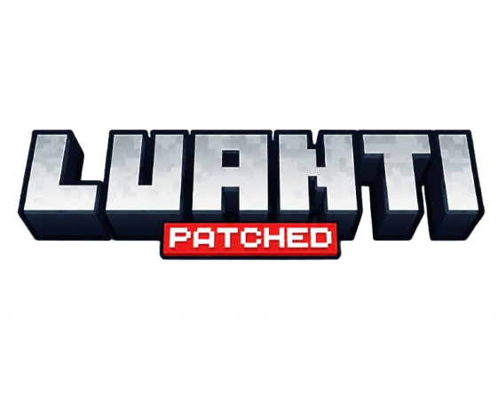

# LPatched
<div align="center">



# **Extended API Reference**

*A complete guide to all custom APIs added by this fork*

**API Version:** 52+ | **Platform:** Android

---

> For core Luanti documentation, visit [docs.luanti.org](https://docs.luanti.org/)

</div>

---

## Table of Contents

1. [Player Synchronisation](#1-player-synchronisation)
2. [Camera API](#2-camera-api)
3. [FOV Control](#3-fov-control)
4. [Android: htmlview](#4-android-htmlview)
5. [glTF Multi-Clip Animation](#5-gltf-multi-clip-animation)
6. [Animation & Scaling](#6-animation--scaling)
7. [glTF Inspection](#7-gltf-inspection)
8. [Bone Transform API](#8-bone-transform-api)
9. [Physics & Movement](#9-physics--movement)
10. [Accessibility](#10-accessibility)
11. [Fog System](#11-fog-system)
12. [World Management](#12-world-management)
13. [Player Callbacks](#13-player-callbacks)

---

## 1. Player Synchronisation

### Overview

This fork introduces a dedicated network packet for updating look direction independently of position. Previously, calling `set_look_vertical` or `set_look_horizontal` triggered a full "teleport" packet that reset the player's position, effectively "freezing" the player during smooth camera animations.

### Methods

```lua
ObjectRef:set_look_vertical(radians)
ObjectRef:set_look_horizontal(radians)
```

| Behavior | Description |
|----------|-------------|
| **Protocol ≥ 52** | Only syncs look direction, player can move freely |
| **Older Clients** | Falls back to teleport behavior for compatibility |

### Example

```lua
minetest.register_globalstep(function(dtime)
    local time = minetest.get_gametime()
    local pitch = math.sin(time * 2) * 0.3
    local player = minetest.local_player
    if player then
        player:set_look_vertical(pitch)
    end
end)
```

---

## 2. Camera API

### set_camera

```lua
ObjectRef:set_camera(table)
```

| Parameter | Type | Default | Description |
|-----------|------|---------|-------------|
| `mode` | string | — | `"firstperson"`, `"thirdpersonback"`, `"thirdpersonfront"` |
| `free_look` | boolean | `false` | Server orientation updates are applied additively |
| `smooth` | boolean | `false` | Smooth orientation changes (0.05s window) |
| `tilt` | number | `0` | Camera roll in degrees |
| `anti_tilt_controller` | boolean | `false` | Controls fixed to screen when camera is tilted |
| `fov` | number | — | Field of View. `0` resets to default |
| `fov_is_multiplier` | boolean | `false` | `fov` treated as base FOV multiplier |
| `fov_transition` | number | `0.0` | Smooth FOV transition duration |

### get_camera

```lua
ObjectRef:get_camera() -> table
```

Returns current camera state including all fields above.

### send_mapblock

```lua
ObjectRef:send_mapblock(pos) -> boolean
```

Forces sending a mapblock to the player. Returns `true` on success.

---

## 3. FOV Control

### set_fov

```lua
ObjectRef:set_fov(degrees, is_multiplier?, transition_time?)
```

| Parameter | Type | Default | Description |
|-----------|------|---------|-------------|
| `degrees` | number | required | FOV in degrees. `0` resets |
| `is_multiplier` | boolean | `false` | Treat as base FOV multiplier |
| `transition_time` | number | `0` | Smooth transition duration |

### get_fov

```lua
ObjectRef:get_fov() -> {fov, is_multiplier, transition_time}
```

---

## 4. Android: htmlview

### Overview

Android-only HTML view system for creating rich UI elements. Destroyed when leaving a world.

> **Platform Restriction:** Throws an error on non-Android platforms.

### Creating Instances

```lua
-- Inline HTML
htmlview.run(id, html_string)

-- External files
htmlview.run_external(id, root_dir, entry?)  -- entry defaults to "index.html"
```

### Headless Workers

```lua
htmlview.run_worker(id, html_string)
htmlview.run_external_worker(id, root_dir, entry?)
```

Workers support `send`, `inject`, `navigate`, `on_message`. `display`/`focus` are ignored.

### Display & Positioning

```lua
htmlview.display(id, opts)
```

| Option | Type | Default | Description |
|--------|------|---------|-------------|
| `visible` | boolean | `true` | Show or hide |
| `safe_area` | boolean | `true` | Respect safe areas |
| `fullscreen` | boolean | `false` | Fill entire screen |
| `drag_embed` / `draggable` | boolean | `false` | Make draggable |
| `border_radius` | number | `0` | Corner radius in pixels |
| `x`, `y` | number/string | `0` | Position or `"center"` |
| `width`, `height` | number/string | `1` | Size in pixels or `"fullscreen"` |

### Focus & Control

```lua
htmlview.focus(id)   -- Bring to front
htmlview.stop(id)    -- Destroy instance
```

### Messaging

```lua
htmlview.send(id, message)              -- Raw string
htmlview.send_json(id, value)           -- JSON-encoded Lua value
htmlview.on_message(id, cb)             -- cb(message_string)
htmlview.on_message_json(id, cb)        -- cb(decoded_table, raw_string) or cb(nil, raw_string, error)
htmlview.on_ready(id, cb)               -- cb() after onPageFinished
htmlview.pipe(from_id, to_id)           -- Forward messages
```

### Navigation & JavaScript

```lua
htmlview.navigate(id, url)
htmlview.inject(id, js)
htmlview.reload(id)  -- Reload without destroying
```

### Shared Memory IPC

```lua
-- Lua side
htmlview.shared_set(key, val)  -- val must be string or nil
htmlview.shared_get(key)       -- Returns nil if not found or empty

-- JavaScript side
luanti.shared_set(key, val);
luanti.shared_get(key);  // Returns string or null
```

### Capture

```lua
htmlview.capture(id, {width?, height?})  -- Defaults to natural size
htmlview.on_capture(id, cb)              -- cb(png_bytes)
```

### Input Control

```lua
htmlview.input(id, {block_game_input = boolean})
```

When enabled, touches outside the view are swallowed.

### State Query

```lua
htmlview.state(id) -> {
    exists = boolean,
    worker = boolean,
    visible = boolean,
    ready = boolean  -- after onPageFinished
}
```

Returns `nil` on error or non-Android.

---

## 5. glTF Multi-Clip Animation

### set_animation

```lua
-- Legacy positional form (clears selected clip)
ObjectRef:set_animation(frame_range, frame_speed, frame_blend, frame_loop)

-- Table form (recommended)
ObjectRef:set_animation(opts)
```

| Option | Type | Default | Description |
|--------|------|---------|-------------|
| `clip` | number/string | — | Clip index (0-based) or name |
| `range` / `frame_range` | `{x, y}` | — | Frame range |
| `frame` | number | — | Single frame `{f, f}` |
| `speed` / `frame_speed` | number | — | Animation speed |
| `speed_scale` | number | `1.0` | Speed multiplier |
| `blend` / `frame_blend` | number | `0.1` | Crossfade duration (seconds) |
| `loop` / `frame_loop` | boolean | — | Loop the animation |
| `pause` / `paused` | boolean | — | Pause (speed = 0) |
| `time_mode` | string | `"auto"` | See Animation & Scaling section |

### set_animation_clip

```lua
ObjectRef:set_animation_clip(clip, frame_range, frame_speed, frame_blend, frame_loop)
```

Explicit clip selection. `clip` can be index or name.

### set_animation_frame_speed

```lua
ObjectRef:set_animation_frame_speed(speed)
```

Directly sets animation speed without changing other parameters.

### get_animation

```lua
ObjectRef:get_animation() -> frame_range, frame_speed, frame_blend, frame_loop, clip
```

Returns five values. `clip` is number, string, or `nil`.

### get_animation_info

```lua
ObjectRef:get_animation_info() -> {
    range = {x, y},
    speed = number,
    blend = number,
    loop = boolean,
    clip = number|string|nil,
    duration = number,  -- seconds (0 if speed is zero)
    progress = nil,     -- placeholder
    bones = nil,        -- placeholder
    is_gltf = boolean,
    unit = "seconds"|"frames"
}
```

---

## 6. Animation & Scaling

### Scaling Properties

Set via `ObjectRef:set_properties()`:

| Property | Type | Description |
|----------|------|-------------|
| `auto_normalize` | boolean | 1 unit in file = 1 node in game |
| `target_height` | number | Force model to specific height in nodes |
| `model_unit_scale` | vector | Additional multiplier after normalization |

```lua
entity.object:set_properties({
    visual = "mesh",
    mesh = "character.gltf",
    auto_normalize = true,
    target_height = 1.7,
    model_unit_scale = {x = 1, y = 1, z = 1}
})
```

### Time Mode

glTF uses seconds; older formats use frames. Use `time_mode` in `set_animation`:

| Mode | glTF | B3D/X |
|------|------|-------|
| `"auto"` (default) | Seconds | Frames. Warning if speed > 5.0 |
| `"seconds"` | Seconds | Converts using 24 FPS |
| `"frames"` | Converts using 24 FPS | Frames |

### Model Introspection

```lua
ObjectRef:get_model_info() -> {
    mesh = string,
    format = "gltf"|"b3d",
    uses_time = boolean,
    default_speed = number
}
```

### Engine Fixes

- Fixed "Tiny Model" bug with degenerate frame ranges
- Cleaner glTF clip transitions
- Safety warnings for high speed with glTF

---

## 7. glTF Inspection

### gltf_get_animation_clips

```lua
core.gltf_get_animation_clips(path) -> list | nil, error_string
```

Returns: `{{index, name, start, end, duration}, ...}`

### gltf_inspect

```lua
core.gltf_inspect(path) -> table | nil, error_string
```

Returns:
```lua
{
    meshes = {{index, name, primitives}, ...},
    bones = {{node, name}, ...},      -- Order non-deterministic
    animations = {{index, name, start, end, duration}, ...}
}
```

> Subject to secure path check.

---

## 8. Bone Transform API

### Overview

Per-bone transform control with independent position, rotation, and scale. Each type is stored separately—`set_bone_rotation` only updates rotation without affecting position or scale.

### Setting Transforms

```lua
ObjectRef:set_bone_position(bone, position, opts?)
ObjectRef:set_bone_rotation(bone, rotation, opts?)
ObjectRef:set_bone_scale(bone, scale, opts?)
```

- `position/rotation/scale`: Table `{x, y, z}` or three numbers. `set_bone_scale` accepts single number for uniform scaling.
- `opts`: `{absolute = bool, interpolation = float}` (degrees for rotation)

### Getting Transforms

```lua
ObjectRef:get_bone_position(bone) -> vector
ObjectRef:get_bone_rotation(bone) -> vector (degrees)
ObjectRef:get_bone_scale(bone) -> vector
ObjectRef:get_bone_world_pos(bone) -> vector
```

### Per-Part Visibility

```lua
ObjectRef:set_part_visible(bone, visible)
```

```lua
player:set_part_visible("Helmet", false)  -- Hide
player:set_part_visible("Helmet", true)   -- Show
```

### Persistent Smoothing

```lua
ObjectRef:set_part_smooth(bone, {
    position = float,
    rotation = float,
    scale = float
})
```

Sets default interpolation durations used when `set_bone_*` lacks explicit `interpolation`.

### Full Bone Override

Comprehensive control for position, rotation, scale, visibility, color, glow, and smooth durations.

```lua
ObjectRef:set_bone_override(bone, {
    position = {vec = {x, y, z}, interpolation = float, absolute = bool},
    rotation = {vec = {x, y, z}, interpolation = float, absolute = bool},
    scale = {vec = {x, y, z}, interpolation = float, absolute = bool},
    visible = boolean,
    pos_smooth = float,
    rot_smooth = float,
    scale_smooth = float,
    color = ColorSpec,    -- e.g. "#FFFFFFFF"
    glow = float
})
```

```lua
ObjectRef:get_bone_override(bone) -> override_table
ObjectRef:get_bone_overrides() -> {bonename = override_table, ...}
```

---

## 9. Physics & Movement

### set_physics_override

```lua
ObjectRef:set_physics_override(table)
```

| Parameter | Type | Default | Description |
|-----------|------|---------|-------------|
| `speed` | number | `1.0` | Speed multiplier |
| `jump` | number | `1.0` | Jump strength multiplier |
| `gravity` | number | `1.0` | Gravity multiplier |
| `liquid_sink` | number | `1.0` | Liquid sink rate multiplier |
| `liquid_sink_force` | number | `1.0` | Liquid sink force multiplier |
| `sneak` | boolean | `true` | Enable sneaking |
| `sneak_glitch` | boolean | `false` | Enable legacy sneak glitch |
| `new_move` | boolean | `true` | Enable new movement code |
| `auto_climb` | boolean | `false` | Auto-climb/descend on ladders |

### Node Groups

| Group | Description |
|-------|-------------|
| `group:lava` | Enables high-viscosity "Lava Physics" |
| `group:disable_jump` | Prevents jumping on/in the node |

---

## 10. Accessibility

### Accessibility Sprint Toggle

Gates the joystick-driven speed boost (1.3x when magnitude ≥ 0.95).

```lua
core.settings:get_bool("accessibilitysprintenabled")
```

Defaults to `true`. Updates in real-time from Accessibility menu.

---

## 11. Fog System

### set_fog

```lua
core.set_fog(player, params_or_nil)
```

Pass `nil` to clear.

| Parameter | Type | Description |
|-----------|------|-------------|
| `color` | ColorSpec | Fog color |
| `fog_start` | number (0..0.99) | Fraction of view distance |
| `fog_end` | number (0..1) | Fraction of view distance |
| `blend_time` | number | Transition duration |
| `max_density` | number (0..1) | Opacity at max height |
| `max_density_height` | number | Node-space height for max density |
| `zero_density_height` | number | Height where fog disappears |
| `uniform` | boolean | Ignore height density |
| `direction` | v3f | Up vector for height calculation |
| `turbulence` | number (0..1) | Noise factor |
| `speed_density_scale` | number | Density based on speed |
| `layers` | array | Up to 4 extra fog layers |
| `color_transition` | table | Dynamic color animation |

### set_fog_boundary

```lua
core.set_fog_boundary(player, params_or_nil)
```

Defines localized fog zone.

| Parameter | Type | Description |
|-----------|------|-------------|
| `pos` | v3f | Center of zone |
| `radius` | number | Node-space size |
| `shape` | string | `"sphere"`, `"box"`, `"cylinder"` |
| `fog` | table | FogParams |
| `sound` | table | `{name, gain, fade_in}` |

### register_biome_atmosphere

```lua
core.register_biome_atmosphere(biome_id, params)
```

Registers fog/boundary for a biome.

---

## 12. World Management

### Client-Side

```lua
core.world_switch(worldname)
```

Only works for local worlds.

### Server-Side

```lua
minetest.world_switch(playername, worldname)
```

Sends request to client.

### create_world

```lua
core.create_world(name, gameid, options) -> success, path_or_error
```

| Option | Type | Description |
|--------|------|-------------|
| `seed` | string/number | World seed |
| `mg_name` | string | Map generator |
| `visible` | string | `"visible"` or `"hidden"` |
| `synchronizes` | string | World to sync data with |
| `mods` / `worldmods` | table/string | Mods to enable/copy |

**Mod Options:**
- String: Directory path, contents expanded to `worldmods/`
- Array: `{"mod1", "mod2"}` enables global mods
- Table with booleans: `{mod = true, mod2 = false}`
- Table with paths: `{name = "path"}` copies mod as `name`

Any other key-value writes directly to `world.mt`.

### get_synchronized_worldpath

```lua
core.get_synchronized_worldpath() -> string | nil
```

---

## 13. Player Callbacks

```lua
core.register_on_jump(function(player))
-- Fired when player jumps

core.register_on_land(function(player))
-- Fired when player lands after being airborne
```

---

<div align="center">

**Last Updated:** June 2026

</div>
